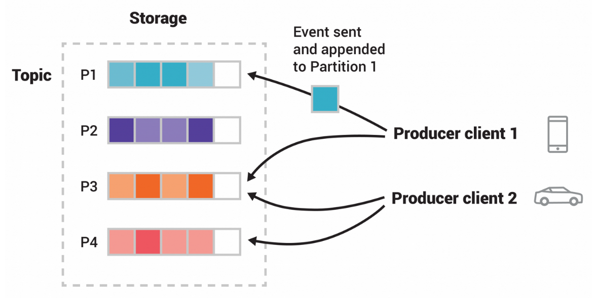
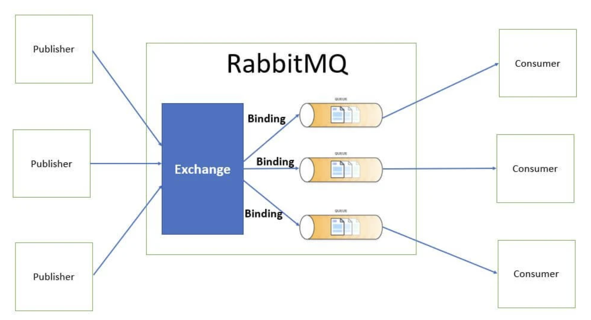

# Message queue: Kafka and RabbitMQ
## Table of Contents
1. [Introduction](#introduction)
2. [Apache Kafka](#apache-kafka)
3. [RabbitMQ](#rabbitmq)
4. [Comparison between RabbitMQ and Kafka](#comparison-between-rabbitmq-and-kafka)
5. [Similarities between Kafka and RabbitMQ](#similarities-between-kafka-and-rabbitmq)
6. [When to use Kafka or RabbitMQ](#when-to-use-kafka-or-rabbitmq)
## Introduction
Kafka and RabbitMQ are message queue systems that you can use in stream processing. 
A data stream consists of high-volume, continuous, incremental data that requires high-speed processing. 

**RabbitMQ** is a distributed message broker that collects streaming data from multiple sources and routes it to different destinations for processing. 

**Apache Kafka** is a streaming platform for building real-time data pipelines and streaming applications. Kafka provides a highly scalable, fault-tolerant, and durable messaging system with more features than RabbitMQ.
## Apache Kafka
**Apache Kafka** is an `open-source distributed event streaming platform` used by thousands of companies for high-performance data pipelines, streaming analytics, data integration, and mission-critical applications.

**Event streaming** is the practice of capturing data in real-time from event sources like databases, sensors, mobile devices, cloud services, and software applications in the form of streams of events; storing these event streams durably for later retrieval; manipulating, processing, and reacting to the event streams in real-time as well as retrospectively; and routing the event streams to different destination technologies as needed. Event streaming thus ensures a continuous flow and interpretation of data so that the right information is at the right place, at the right time.

Kafka combines three key capabilities so you can implement your use cases for event streaming end-to-end with a single battle-tested solution:
1. To **publish** (write) and **subscribe to** (read) streams of events, including continuous import/export of your data from other systems.
2. To **store** streams of events durably and reliably for as long as you want.
3. To **process** streams of events as they occur or retrospectively.

Kafka can be deployed on bare-metal hardware, virtual machines, and containers, and on-premises as well as in the cloud. You can choose between self-managing your Kafka environments and using fully managed services offered by a variety of vendors.

Kafka is a distributed system consisting of servers and clients that communicate via a high-performance TCP network protocol:

- **Servers**: Kafka is run as a cluster of one or more servers that can span multiple datacenters or cloud regions. Some of these servers form the storage layer, called the brokers. Other servers run Kafka Connect to continuously import and export data as event streams to integrate Kafka with your existing systems such as relational databases as well as other Kafka clusters. To let you implement mission-critical use cases, a Kafka cluster is highly scalable and fault-tolerant: if any of its servers fails, the other servers will take over their work to ensure continuous operations without any data loss.
- **Clients**: They allow you to write distributed applications and microservices that read, write, and process streams of events in parallel, at scale, and in a fault-tolerant manner even in the case of network problems or machine failures. Kafka ships with some such clients included, which are augmented by dozens of clients provided by the Kafka community: clients are available for Java and Scala including the higher-level Kafka Streams library, for Go, Python, C/C++, and many other programming languages as well as REST APIs.

An `event` records the fact that "something happened" in the world or in your business. When you read or write data to Kafka, you do this in the form of events. Conceptually, an event has a key, value, timestamp, and optional metadata headers. 

`Producers` are those client applications that publish (write) events to Kafka, and consumers are those that subscribe to (read and process) these events. In Kafka, producers and consumers are fully decoupled and agnostic of each other, which is a key design element to achieve the high scalability that Kafka is known for. For example, producers never need to wait for consumers. Kafka provides various guarantees such as the ability to process events exactly-once.

Events are organized and durably stored in `topics`. Very simplified, a topic is similar to a folder in a filesystem, and the events are the files in that folder.  Topics in Kafka are always **multi-producer** and **multi-subscriber**: a topic can have zero, one, or many producers that write events to it, as well as zero, one, or many consumers that subscribe to these events. Events in a topic can be read as often as needed—unlike traditional messaging systems, events are not deleted after consumption. Instead, you define for how long Kafka should retain your events through a per-topic configuration setting, after which old events will be discarded. Kafka's performance is effectively constant with respect to data size, so storing data for a long time is perfectly fine.

Topics are partitioned, meaning a topic is spread over a number of "buckets" located on different Kafka brokers. This distributed placement of your data is very important for scalability because it allows client applications to both read and write the data from/to many brokers at the same time. When a new event is published to a topic, it is actually appended to one of the topic's partitions. Events with the same event key (e.g., a customer or vehicle ID) are written to the same partition, and Kafka guarantees that any consumer of a given topic-partition will always read that partition's events in exactly the same order as they were written.

*This example topic has four partitions P1–P4. Two different producer clients are publishing, independently from each other, new events to the topic by writing events over the network to the topic's partitions. Events with the same key (denoted by their color in the figure) are written to the same partition. Note that both producers can write to the same partition if appropriate.*

To make your data fault-tolerant and highly-available, every topic can be **replicated**, even across geo-regions or datacenters, so that there are always multiple brokers that have a copy of the data just in case things go wrong, you want to do maintenance on the brokers, and so on. A common production setting is a replication factor of 3, i.e., there will always be three copies of your data. This replication is performed at the level of topic-partitions.

Kafka **use cases**:
1. `Messaging`: in comparison to most messaging systems Kafka has better throughput, built-in partitioning, replication, and fault-tolerance which makes it a good solution for large scale message processing applications. 
Messaging uses are often comparatively low-throughput, but may require low end-to-end latency and often depend on the strong durability guarantees Kafka provides. 
In this domain Kafka is comparable to traditional messaging systems such as ActiveMQ or RabbitMQ.
2. `Website Activity Tracking`: the original use case for Kafka was to be able to rebuild a user activity tracking pipeline as a set of real-time publish-subscribe feeds. This means site activity (page views, searches, or other actions users may take) is published to central topics with one topic per activity type. 
These feeds are available for subscription for a range of use cases including real-time processing, real-time monitoring, and loading into Hadoop or offline data warehousing systems for offline processing and reporting. 
Activity tracking is often very high volume as many activity messages are generated for each user page view.
3. `Metrics`: often used for operational monitoring data. This involves aggregating statistics from distributed applications to produce centralized feeds of operational data.
4. `Stream Processing`: many users of Kafka process data in processing pipelines consisting of multiple stages, where raw input data is consumed from Kafka topics and then aggregated, enriched, or otherwise transformed into new topics for further consumption or follow-up processing.
5. `Event Sourcing`: is a style of application design where state changes are logged as a time-ordered sequence of records. Kafka's support for very large stored log data makes it an excellent backend for an application built in this style.
6. `Commit Log`: Kafka can serve as a kind of external commit-log for a distributed system. The log helps replicate data between nodes and acts as a re-syncing mechanism for failed nodes to restore their data. The log compaction feature in Kafka helps support this usage.
## RabbitMQ
RabbitMQ is a reliable and mature messaging and streaming broker, which is easy to deploy on cloud environments, on-premises, and on your local machine. It is currently used by millions worldwide.

One of RabbitMQ's main strengths is its adherence to the `Advanced Message Queuing Protocol` (AMQP). This standardized protocol was designed to ensure that messages are reliably delivered between applications, regardless of their location or the platform they are running on. AMQP defines precise rules for message formatting, delivery, and acknowledgment, ensuring that every message sent through an AMQP-based system, such as RabbitMQ, reaches its destination as expected.

Distinctive features of RabbitMQ:
1. **Reliable Messaging**: RabbitMQ ensures that sent messages are not lost, thanks to its persistence and delivery confirmations.
2. **Advanced Routing**: with multiple exchange types, RabbitMQ can precisely determine how and where a message should be delivered, enabling complex routing scenarios.
3. **Persistence**: messages in RabbitMQ can be saved to disk, ensuring that they are not lost even in the event of system failures.
4. **Extended Features**: RabbitMQ is not limited to the AMQP protocol. With the use of plugins, it can support other protocols such as MQTT and STOMP, making it extremely versatile.

The **RabbitMQ architecture** includes:

- `Publisher`: is the entity or component responsible for sending messages to RabbitMQ. It can be an application, a service or any other system that needs to transmit data. 
It takes care of initiating the communication and does not worry about how or where the message will be delivered, it simply sends it to the appropriate exchange.
- `Consumer`: it is the entity that actively listens to one or more queues waiting for messages to be processed. 
Once a message arrives in a queue to which the consumer is subscribed, the consumer picks it up, processes it, and, if necessary, sends a confirmation of receipt or processing.
- `Exchange`: is a crucial component in RabbitMQ that acts as a router for messages sent by producers. 
It does not hold messages, but relies on rules and criteria (such as the routing key) to determine which queue to forward a message to. There are several types of exchanges in RabbitMQ that determine how messages are forwarded:
    - **Direct Exchange**: it acts as a unique router for messages based on a routing key.
When a producer sends a message to a Direct Exchange, it specifies a routing key. The exchange then forwards the message to the queue that has a binding to that specific routing key. This ensures targeted and precise delivery of the message.
    - **Fanout Exchange**: it is the equivalent of a broadcast in terms of messaging. It does not take into account routing keys or other message attributes.
When a message arrives at a Fanout Exchange, it is forwarded to all queues connected to that exchange, without discrimination. It is ideal for scenarios where you want a message to reach as many consumers as possible.
    - **Topic Exchange**: it offers greater flexibility than Direct Exchange, allowing messages to be forwarded based on routing key schemes rather than exact keys.
Routing keys in a Topic Exchange can contain special characters, such as * (matching one word) and # (matching zero or more words). This allows you to create complex patterns that can correspond to multiple queues, making message delivery more dynamic and flexible.
    - **Headers Exchange**: unlike other exchanges that rely on routing keys, the Headers Exchange uses message header attributes to determine delivery.
When a message is sent to a Headers Exchange, the exchange evaluates the message headers and compares them to the binding criteria of the attached queues. If the headers match the criteria, the message is forwarded to the appropriate queue. This type of exchange offers a level of granularity and complexity in message delivery based on multiple attributes.
- `Queue`: it is essentially a buffer that holds messages until they are consumed by a consumer. 
Every message sent through RabbitMQ is held in a queue waiting to be processed. Queues ensure that messages are not lost and are processed in order.
- `Binding`: is a rule or set of instructions that determines how a message should be forwarded from the exchange to the queue. 
It serves as a bridge between exchange and queue, ensuring that messages are forwarded correctly based on the needs of the application.

RabbitMQ **use cases**:
1. `Application integration`: refers to RabbitMQ's ability to act as a bridge between different applications or systems.
Applications can communicate with each other without directly depending on each other (**decoupling**). RabbitMQ provides a uniform interface for sending and receiving messages, regardless of the platform or programming language of the integrated applications (**uniformity**).
2. `Distributed processing`: refers to RabbitMQ's ability to distribute tasks or jobs to different workers or nodes for parallel processing: optimization of resources and reduction of processing times.
3. `Buffering`: refers to its ability to temporarily hold messages awaiting processing. In the event of traffic spikes or system overload, RabbitMQ ensures that messages are not lost (**resiliency**). Messages can be processed when resources become available, ensuring smooth, uninterrupted processing (**delayed processing**).
4. `Logs and monitoring`: can be used to track and monitor activities or events within an application or system.
## Comparison between RabbitMQ and Kafka
RabbitMQ and Apache Kafka move data from producers to consumers in different ways:
- RabbitMQ is a general-purpose message broker that prioritizes end-to-end message delivery;
- Kafka is a distributed event streaming platform that supports the real-time exchange of continuous big data.

In RabbitMQ, the broker ensures that consumers receive the message. The consumer application takes a passive role and waits for the RabbitMQ broker to push the message into the queue. For example, a banking application might wait for SMS alerts from central transaction processing software.

Kafka consumers, however, are more proactive in reading and monitoring information. As messages are added to physical log files, Kafka consumers track the last message read and update their offset tracker accordingly. An offset tracker is a counter that is incremented each time a message is read. With Kafka, the producer is unaware of message retrieval by consumers.

A RabbitMQ broker routes the message to the destination queue. Once read, the consumer sends an acknowledgment response (ACK) to the broker, who then deletes the message from the queue.

Unlike RabbitMQ, Apache Kafka adds the message to a log file, which remains until the retention period expires. This way, consumers can reprocess the streamed data at any time within the stipulated period.

| | RabbitMQ | Kafka |
| -------- | -------- | -------- |
| Architecture | complex message routing, push model, producers send messages to consumers with different rules. | partition-based design for real-time, high-throughput stream processing, pull model, producers publish messages to topics and partitions that consumers subscribe to. |
| Message management | monitor message consumption, delete messages after they are consumed, and support message priorities. | consumers track message retrieval with an offset tracker, Kafka retains messages based on the retention policy and there is no priority for messages. |
| Performance | low latency, sends thousands of messages per second. | transmits up to millions of messages per second in real time. |
| Programming language and protocol | supports a wide range of legacy languages ​​and protocols. | it has a limited choice of programming languages ​​and uses the binary protocol over TCP for data transmission. |

## Similarities between Kafka and RabbitMQ
### Scalability
RabbitMQ can expand its message handling capacity both horizontally and vertically. To increase the efficiency of message exchange, you can allocate more processing resources to the RabbitMQ server. In some cases, developers use a message distribution technique called consistent hash exchange for RabbitMQ that allows load balancing across multiple brokers.

Similarly, the Kafka architecture allows you to add multiple partitions to a specific topic to distribute the message load evenly.
### Fault tolerance
Both Kafka and RabbitMQ are message queuing architectures that stand out for their reliability and resistance to system failures.

You can group various RabbitMQ brokers into clusters and deploy them on different servers. RabbitMQ also replicates queued messages across distributed nodes. This allows the system to recover from failures affecting any server.

Like RabbitMQ, Apache Kafka offers similar recovery and redundancy options by hosting Kafka clusters on different servers. Each cluster consists of log file replicas that can be recovered in the event of a failure.

### Ease of use
Both message queue systems have broad community support and libraries that make it easy to send, read, and process messages. This makes developing client applications easier for developers on both systems.

## When to use Kafka or RabbitMQ
| Use case | Technology | Why |
| -------- | -------- | -------- |
| Replay of the event stream | **Kafka** | Kafka is suitable for applications that need to re-analyze the received data. You can process streaming data multiple times during the retention period or collect log files for analysis. |
| Real-time data processing | **Kafka** | Kafka transmits messages with very low latency and is suitable for analyzing streaming data in real time. |
| Complex routing architecture | **RabbitMQ** | RabbitMQ offers great flexibility to customers with vague requirements or complex routing scenarios. |
| Effective message delivery | **RabbitMQ** | RabbitMQ adopts the push model, which ensures that the producer is notified when a client application has consumed a message. It is suitable for applications that must meet specific sequences and delivery guarantees when exchanging and analyzing data. |
| Language and protocol support | **RabbitMQ** | Developers use RabbitMQ for customer applications that require compatibility with legacy protocols such as MQTT and STOMP. |