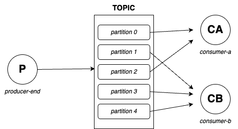
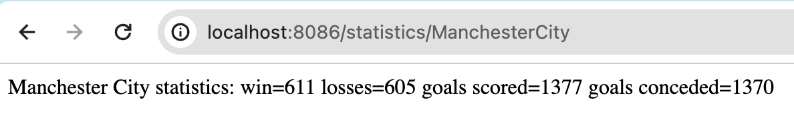

# Kafka project

This architecture involves a producer generating messages to be added to a topic with 5 partitions. Two microservice consumers are responsible for consuming these messages. Upon connecting Kafka, the system ensures that each consumer is assigned unique partitions to avoid message duplication. This design prevents both consumers from reading the same messages.

In this project sample, the Kafka configuration utilizes the `acks` property to **all** to ensure disk persistence. 
This means that the producer will await confirmation from all brokers before considering a message delivered.

Additionally, the consumer is configured with `auto.offset.reset` set to **earliest**, allowing it to read from a previous point in the Kafka message log in case a consumer joins an already running consumer group and needs to recover any missed events or reread from a previous point.

The `errorHandler` method, defined in KafkaConfig.java, returns an instance of DefaultErrorHandler, which is part of the Spring Kafka libraries and is used to handle errors during the processing of Kafka messages by consumers.
 
The **DeadLetterPublishingRecoverer** is a recoverer that sends messages causing errors to a "dead letter queue" (DLQ). This is a typical pattern for handling problematic messages that cannot be processed correctly by consumers.
 
The **FixedBackOff** specifies a retry policy with a fixed delay (1000 milliseconds) and a maximum number of attempts (in our case: 2). This is used to retry processing messages in case of temporary errors.

## Kafka Stream

I've created an example using Apache Kafka Streams in Spring Boot. 
 
A `stream producer` generates football matches with random results and teams. These messages are then inserted into the **matches** topic. 

Subsequently, a consumer fetches the message stream from the topic and filters them by a specified team (in this case, "Manchester City"). Each time it receives a filtered match, it prints it out. 

Furthermore, for all filtered matches, statistics are calculated including wins, losses, goals conceded, and goals scored. These results are saved and published to the URL http://localhost:8086/statistics/ManchesterCity.

