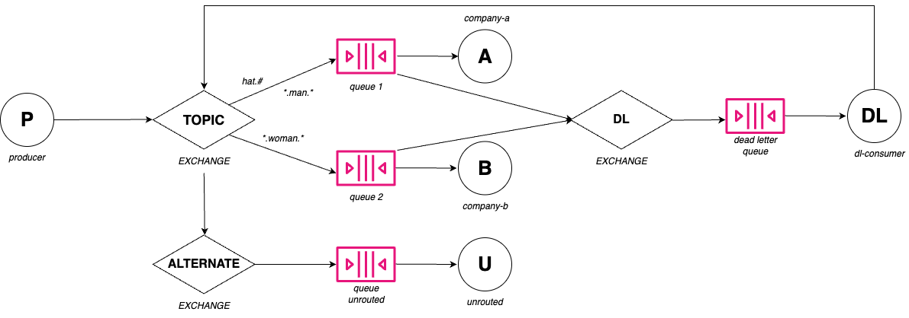

# RabbitMQ project

The system comprises five distinct microservices, each fulfilling a unique role within the broader ecosystem.

One of your microservices acts as a `message producer`. This service is responsible for generating and sending messages to a **topic exchange** within RabbitMQ. A topic exchange is a type of exchange that routes messages to queues based on wildcard matches between the routing key and the routing pattern specified by the queues.

The topic exchange is configured to distribute messages between two specific queues: queue 1 and queue 1. Each of these queues is bound to the exchange with specific routing keys that determine which messages they should receive.

Despite these bindings, there are occasions where a message's routing key does not match any of the specified patterns for queue 1 or queue 2. To handle such scenarios gracefully, I have configured an alternate exchange. 

The `alternate exchange` serves as a fallback mechanism, ensuring that messages with unmatched routing keys are not lost. Instead, these messages are directed to a dedicated unrouted queue.

This unrouted queue can be used for various purposes, such as logging, analysis, or even reprocessing the messages after correcting any routing key mismatches.

To further enhance the reliability and robustness of my message processing system, both queue 1 and queue 2 are equipped with a `Dead Letter Exchange` (DLX). A DLX is used to capture messages that cannot be processed by the queue, typically due to exceeding the maximum number of delivery attempts, message expiration, or rejection by consumers.

When a message in either queue cannot be processed as expected, it is redirected to its respective **dead letter queue** (DLQ). This setup allows you to inspect, analyze, and handle failed messages separately, without disrupting the flow of valid messages in the main queues.

Moreover, there is an additional microservice dedicated to handling messages from the dead letter queues. This microservice attempts to re-route messages from the DLQs back to the topic exchange. This **retry mechanism** gives messages another chance to be processed correctly and routed to the appropriate queue. The system is designed to allow up to three retries for each message, increasing the likelihood that transient issues do not lead to message loss.